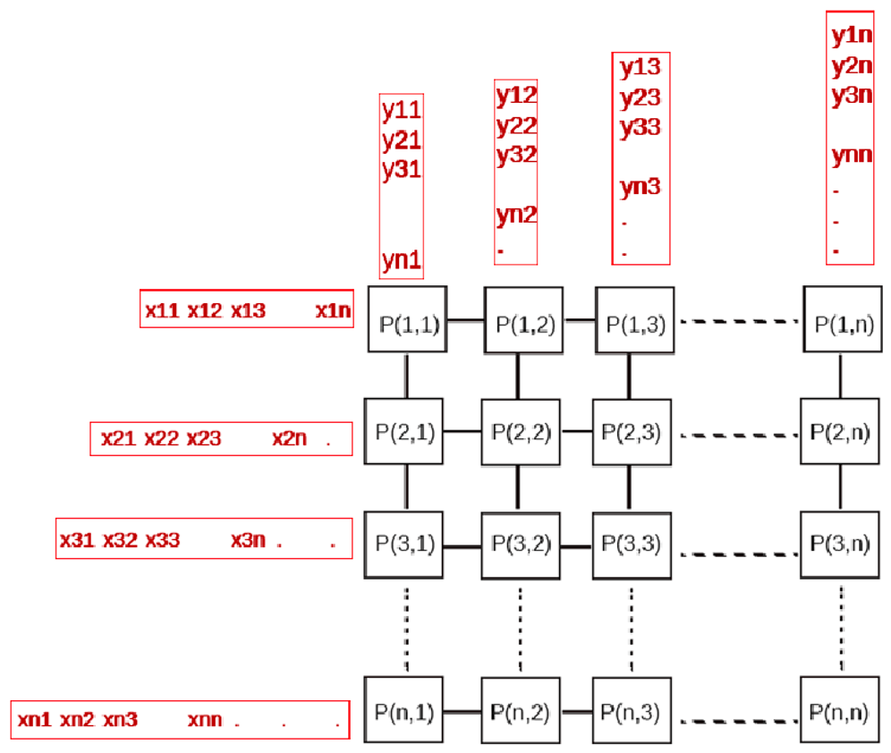

# PRL - Mesh Multiplication

#### Vypracoval: Dominik Švač
#### Rok: 2021


Mesh Multiplication je paralelný algoritmus na násobenie matíc. Využíva sa 𝑛×𝑚 procesorov, pričom n sú riadky výslednej matice a m sú stĺpce výslednej matice. Každý proces sa stará o jednu hodnotu výsledku. Procesory sú mriežkovito poprepájané, ako je to znázornené na nasledujúcom obrázku 1. Prvky prvej matice A vchádzajú do mriežky z ľava do prava. Prvky druhej matice B vchádzajú do mriežky z hora dole. Prvky niesú privádzané súčastne, ale sú vždy o jedno miesto posunuté. Každý procesor obashuje jeden register C, ktorý na začiatku má hodnotu 0. Ak procesor obdrží obe hodnoty (z matice A aj B) tak ich vynásobí a výsledok pripočíta z registru C. Hodnotu z matice A pošle procesoru, ktorý je na pravo od neho a hodnotu z matice B pošle procesoru, ktorý je na dol od neho.



### Vstup

2 súbory, ktoré obsahujú prvky matice (mat1, mat2)

```
(mat1)      (mat1)             (output)
4           3                   4:3
1 2 1       1 2 1               5 7 5
4 5 6       1 2 1          ->   21 24 21
1 1 1       2 1 2               4 5 4
2 1 2                           7 8 7
```

### Požiadavky

Knižnica Open MPI

### Spustenie

```
./test.sh - spustí sa program mm a na stdout sa vypíše výsledok násobenia matíc mat1 a mat2
```
